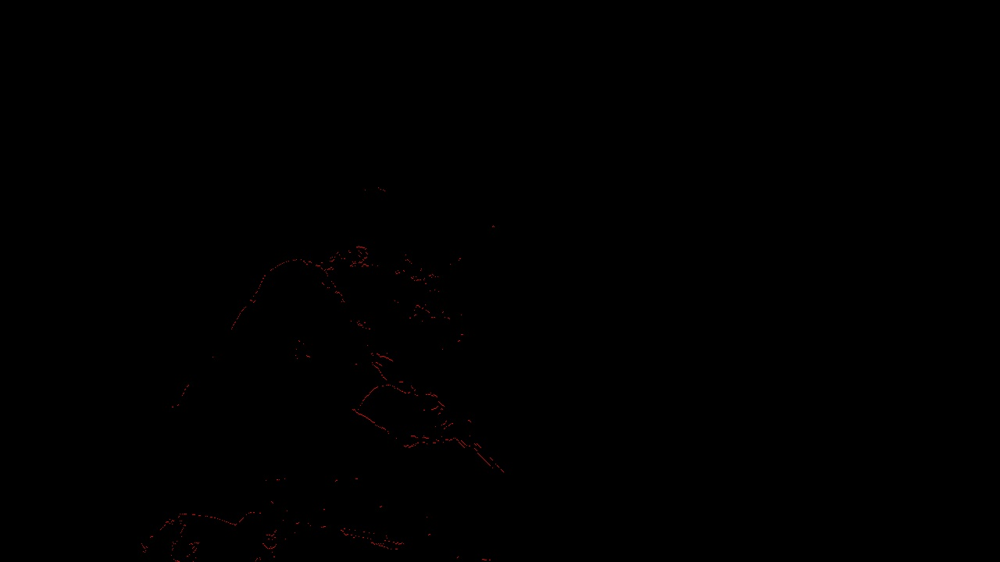

# 2D Feature Particles

An open source Python app that creates 2D particles from images (or videos
) using feature points from Computer Vision feature detectors. Giving the
 information of the silhouettes in some cool abstract way.

## Project Update - Nov 20, 2020

I knew I could use OpenCV for getting FAST features, but I didn't have it
installed in my computer and haven't used it for about 4 years, so I looked
again at how to implement FAST features to do it myself without OpenCV.

It was a bit difficult so I looked for an implementation in Python online and 
found this [https://github.com/tbliu/FAST](https://github.com/tbliu/FAST).

I tried it and had this result:

Original Image  

Result Using FAST from tbliu (It looks good but I think it would be better if
the points are not so close from each other, I might have to do something to
sample them spatially)

But the time to generate it was far from "FAST". It took 1 minute to generate
one image, so clearly is not for real-time (like what I saw in the concert) but
anyway I wasn't expecting to make it work in real-time, my goal is to generate
a video offline with a duration of at least a minute. At 30 FPS that would be
generating 1800 images. That would make 1800 minutes or 30 hours of processing.

That's a lot of hours, but I should be able to run it remotely in the lab
from the university (I have successfully run other Python programs for days
before). But that is not counting the particles part of the program, all the
physics calculations...

I think the calculations shouldn't take too much time per frame and I should be
able to implement them somewhat efficiently, so that doesn't worry me much. I
would not be implementing collision detection, the particles would just have
lifespan, position, velocity and color.

I think also the fact that I'm using a HD image adds complexity to the feature
detection part. There are millions of pixels that have to be checked, and I
wouldn't use smaller images because that would eliminate image quality that I
think it's important for the aesthetics in this case.

Finally, I installed OpenCV in a Ubuntu WLS inside Windows, and I will be trying
to use that instead. I didn't have enough time to create the particle class, so
I will also work on that next.

### Summary

- I got a working test of FAST feature detection. It's too slow and points are
 too close from each other.
- I installed OpenCV, I'll try their implementation.
- The results look good overall, so I think I'm going in the right way

### What's next

In the next two weeks I'll have to:
- Create Particle class with it's logic
- Program that creates particles from an image
- Find a way to turn a video into frames
- Calculate physics from the set of ordered frames and output new frames

Something to have in mind is that it could take me many hours to generate a
 video

## Project Proposal - Nov 5, 2020

[proposal](proposal/)
