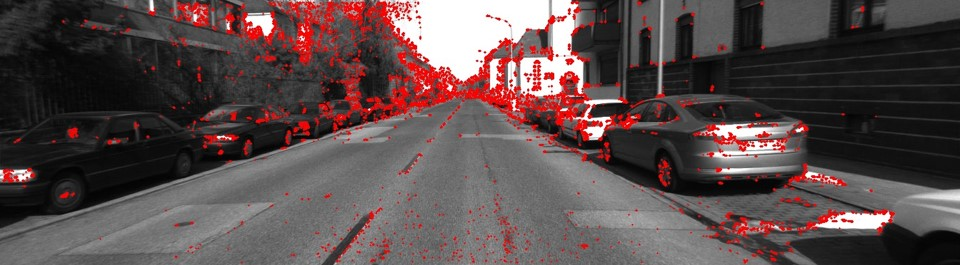

# Project Proposal - *2D Feature Particles*

## The Problem

Years ago I was in a concert of the band Sigur Rós, which is known for having great live performances,
creating a particular unique atmosphere. There where two large displays that focused on the members of
the band as they played. But had different effect filters applied in real-time (or at most with about
2 seconds of delay). In one song there was an effect that I thought it was really cool and I never saw
it before and I wonder how they were doing it.

The effect was that instead of showing the normal image, the image was a black background and there
where only red dots forming the image, but they where in the outlines of the players, so everyone could
clearly see their shapes. But the red dots, moved as the players moved. This generated an amazing artistic
result.

My idea is to implement a similar video filter. To do that I would need to solve this:

- Find where to put each dot for one image
- Find out how to "move" each dot in the next frame, if they need to move or if it is OK to just generate new ones
- See if changing the color (and maybe the transparency or the size) of the dots over time have good artistic results

I think this problem could be important because I haven't seen many filters doing that. And videos
are used very often this days, I think many people would like to have something like that. Specially in
music videos, which are more abstract and where the artistic feeling is more relevant.

## Proposed Solution

As an undergrad I spent about 2 years doing Research in Computer Vision. So I'm familiar with feature
detection in images. I think it can be possible to find the positions for each dot (particle) using
the FAST corner detection [[1]](https://en.wikipedia.org/wiki/Features_from_accelerated_segment_test).
The problem with that particular algorithm is that it only detects corners, so there may be some outlines
that would be left out. I think also running an edge detector and sampling random points from the edges
could work.

An example of FAST corner detection

After selecting where to place each particle, I would store them as objects which have certain life span,
and that their position can be changed, just as a particle. I think it would be good to have a force field
affecting them, simulating the effect of wind. And to have their color decreasing in time so that they became
less relevant.

This project is related to graphics because it generates images after making computations.

## Plan

**Week 1 & 2** (Nov. 6 - 20): Implement particles for only one image

**Week 3** (Nov. 20 - 27): Implement creation of particles for multiple frames and effects of force fields

**Week 4** (Nov. 28 - Dec. 4): Test different effect variations like change of color. Write final report                                                               

Jesús Henríquez
